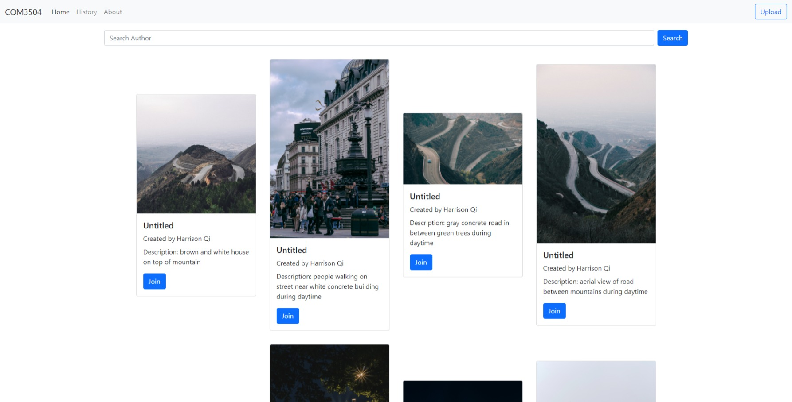
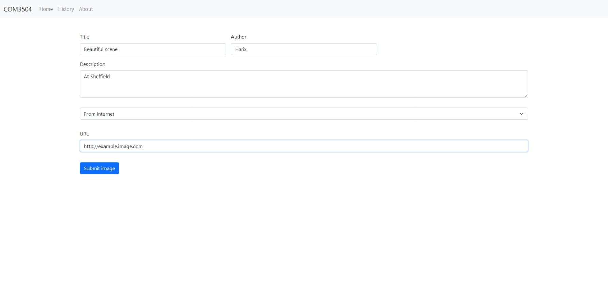
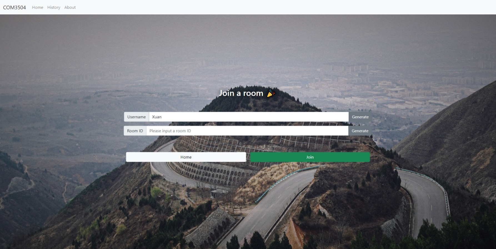
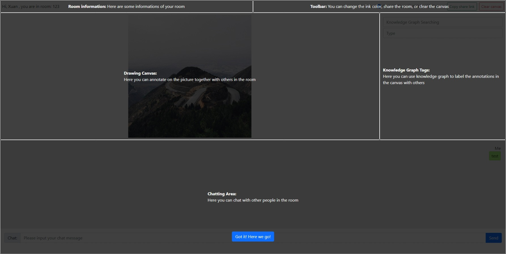
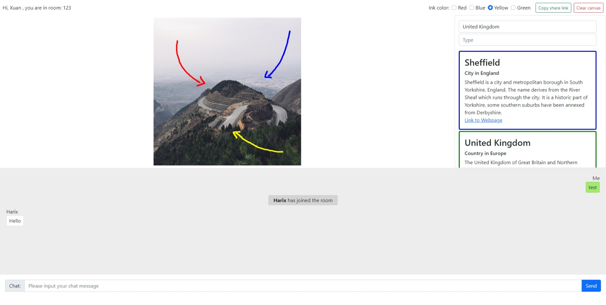

# COM3504The-Intelligent-Web

## Setup

1. Go to the project directory
2. Run `npm install` to install the required packages
3. Make sure your mongoDB service is running on port `27017`
4. Make sure the database `com3504` is empty
5. Run `npm start` to start up the server
6. Browse [http://localhost:3000](http://localhost:3000)

## How to use

Note: In this system, all chat and annotation history will be saved locally and the server will not record any of your data. (except for uploading images). Also, the system can be used offline， you can access your history without an internet connection.

### Upload an image

1. Go to `Home` page
2. Click `Upload` button on the top-right corner
3. Fill-in information
4. Select an upload method (URL/File/Camera) and select the image you want to upload
5. Click the `Submit` button
6. If succeed, you will then redirect to its `Join` page, you can then input a username and room number to start a annotation session

### View all the images and search for a author

1. Go to `Home` page
2. You can see all the uploaded images as a gallery
3. Fill input `Search Author` with a author name, and click button `Search`
4. Search result will be shown on the same page

### Start a annotation session

1. Go to `Home` page
2. Find an image you like
3. Click `Join` button
4. Input your username and a room number to start a new annotation session or join an existing room.

#### Chat with others

You can chat with other users in the chat area of a room. When offline, messages will not be sent and will be marked as `(unsent)`.

#### Drawing annotation

In the Drawing Canvas area, you can annotate on the picture using your mouse together with other users. In the toolbar, you can change the colour of the ink.

#### Tag drawing annotation with Knowledge Graph

In the Knowledge Graph Tags area, you can use knowledge graph to label the annotations in the canvas with others. In the toolbar, you can change the ink colour of the label.

#### Clear canvas

When you click on `Clear Canvas` button in the top right corner, the Drawing Canvas and the corresponding Knowledge Graph Tags will be cleared for all users in the room.

#### Share room

When you click the `Copy Share Link` button, the share link of the room will be placed in your clipboard. You can share this link with others, then they can join your room via this link.

## Screenshots

## Roadmap/TODO

 - [x] Users can upload images form URL/File/Camera
 - [x] Server store uploaded images to MongoDB
 - [x] Users can view all uploaded images
 - [x] Users can search for images
 - [x] Users can start an annotation session by selecting an image and choose a room number
 - [x] Users can chat within a room
 - [x] Users can draw on the image within a room
 - [x] Offline experience with Service Worker
 - [x] Chatting history can be stored in IndexedDB
 - [x] Drawing history can be stored in IndexedDB
 - [x] Knowledge Graph embedded
 - [x] Knowledge Graph tags can link to drawing annotations (by color)
 - [x] Users can share Knowledge Graph tags within a room
 - [x] Knowledge Graph tags can be stored in IndexedDB

## Contact
We are team WUBBA LUBBA DUB-DUB.
If you would like to contact us, here are our contact details and Github links：

 - Boxuan Shan: bshan3@sheffield.ac.uk
 - JingXiang Qi: jqi6@sheffield.ac.uk
 - Ziting Zhao: zzhao30@sheffield.ac.uk
 - Github: [https://github.com/ace18zz/COM3504The-Intelligent-Web](https://github.com/ace18zz/COM3504The-Intelligent-Web)
